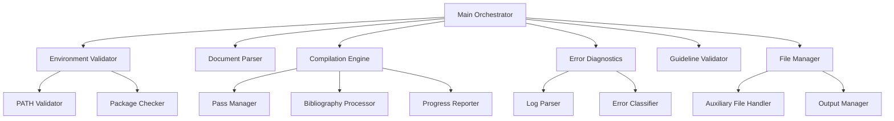
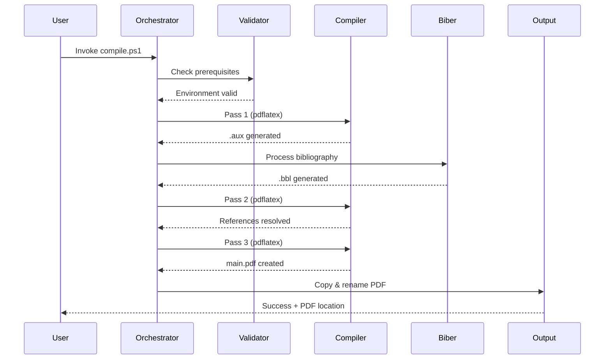
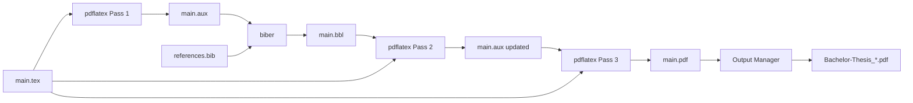
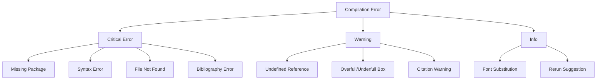

# Design Document: LaTeX Thesis Workflow

## Overview

The LaTeX Thesis Workflow system is a PowerShell-based automation tool that orchestrates the compilation of a Bachelor's thesis document at FOM Hochschule. The system manages the complex multi-pass compilation workflow required by LaTeX, including bibliography processing with biber, cross-reference resolution, and table of contents generation.

### Key Design Goals

1. **Automation**: Eliminate manual intervention in the compilation process
2. **Reliability**: Detect and report errors at each compilation stage
3. **Compliance**: Validate FOM Hochschule guideline conformance
4. **Usability**: Provide clear progress feedback and actionable error messages
5. **Maintainability**: Structure code for extensibility and future enhancements

### System Context

The system operates within a Git-managed thesis repository with the following structure:

```
BachlorsThesis/
├── Paper/                    # Working directory for compilation
│   ├── main.tex              # Main document
│   ├── references.bib        # Bibliography database
│   ├── chapters/*.tex        # Chapter content files
│   └── pic/                  # Image assets
├── scripts/                  # Compilation scripts
│   └── compile.ps1           # Main compilation orchestrator
├── HowTo/                    # FOM guideline documents
└── Bachelor-Thesis_*.pdf     # Output PDF (root directory)
```

The workflow integrates with TeX Live 2026+ distribution and requires pdflatex and biber executables in the system PATH.

## Architecture

### Component Architecture

The system follows a modular architecture with clear separation of concerns:



### Execution Flow



### Data Flow



## Components and Interfaces

### 1. Main Orchestrator Module

**Responsibility**: Coordinates all compilation stages and error handling.

**Interface**:
```powershell
Function Invoke-ThesisCompilation {
    [CmdletBinding()]
    Param(
        [string]$WorkingDirectory = "$PSScriptRoot\..\Paper",
        [string]$OutputDirectory = "$PSScriptRoot\..",
        [switch]$Clean,
        [switch]$Incremental,
        [switch]$ValidateOnly
    )
}
```

**Key Methods**:
- `Initialize-Environment()`: Set up paths and validate prerequisites
- `Execute-CompilationPipeline()`: Run the multi-pass workflow
- `Handle-CompilationError()`: Process and report errors
- `Finalize-Output()`: Copy and rename the final PDF

### 2. Environment Validator Module

**Responsibility**: Verify LaTeX distribution and required packages.

**Interface**:
```powershell
Function Test-LaTeXEnvironment {
    [CmdletBinding()]
    Param(
        [string[]]$RequiredExecutables = @('pdflatex', 'biber'),
        [string[]]$RequiredPackages = @('biblatex', 'babel-german', 'geometry')
    )
    [ValidateResult]
}

Class ValidateResult {
    [bool]$IsValid
    [string[]]$MissingExecutables
    [string[]]$MissingPackages
    [string[]]$InstallationInstructions
}
```

**Key Methods**:
- `Test-ExecutableInPath()`: Check for pdflatex and biber availability
- `Test-PackageInstallation()`: Query kpsewhich for package presence
- `Get-InstallationInstructions()`: Generate tlmgr commands for missing packages

### 3. Document Parser Module

**Responsibility**: Extract structural information from LaTeX source files.

**Interface**:
```powershell
Function Get-DocumentStructure {
    [CmdletBinding()]
    Param(
        [string]$MainDocument,
        [string]$BaseDirectory
    )
    [DocumentStructure]
}

Class DocumentStructure {
    [string]$MainFile
    [string[]]$ChapterFiles
    [string]$BibliographyFile
    [hashtable]$PackageUsage
    [bool]$IsValid
    [string[]]$ValidationErrors
}
```

**Key Methods**:
- `Parse-InputDirectives()`: Extract `\input{}` and `\include{}` directives
- `Validate-FileReferences()`: Check existence of referenced files
- `Parse-BibliographyFile()`: Validate .bib file syntax

### 4. Compilation Engine Module

**Responsibility**: Execute LaTeX compilation passes and bibliography processing.

**Interface**:
```powershell
Function Invoke-CompilationPass {
    [CmdletBinding()]
    Param(
        [int]$PassNumber,
        [string]$MainDocument,
        [string]$WorkingDirectory,
        [hashtable]$CompilationOptions
    )
    [CompilationResult]
}

Function Invoke-BibliographyProcessing {
    [CmdletBinding()]
    Param(
        [string]$MainDocument,
        [string]$WorkingDirectory
    )
    [CompilationResult]
}

Class CompilationResult {
    [bool]$Success
    [int]$ExitCode
    [string]$StandardOutput
    [string]$StandardError
    [TimeSpan]$Duration
    [string[]]$Errors
    [string[]]$Warnings
}
```

**Key Methods**:
- `Invoke-PdfLatex()`: Execute pdflatex with configured options
- `Invoke-Biber()`: Execute biber for bibliography processing
- `Monitor-ProcessOutput()`: Capture real-time compilation output
- `Parse-ExitCode()`: Interpret process exit codes

### 5. Error Diagnostics Module

**Responsibility**: Parse LaTeX log files and classify errors.

**Interface**:
```powershell
Function Get-CompilationDiagnostics {
    [CmdletBinding()]
    Param(
        [string]$LogFile,
        [string]$BlgFile
    )
    [DiagnosticReport]
}

Class DiagnosticReport {
    [LaTeXError[]]$CriticalErrors
    [LaTeXWarning[]]$Warnings
    [string]$Summary
}

Class LaTeXError {
    [string]$Type
    [string]$File
    [int]$Line
    [string]$Message
    [string]$Severity  # 'Critical', 'Warning', 'Info'
}
```

**Key Methods**:
- `Parse-LogFile()`: Extract errors from .log file
- `Parse-BlgFile()`: Extract bibliography errors from .blg file
- `Classify-ErrorType()`: Categorize errors (undefined reference, missing package, syntax error)
- `Format-ErrorMessage()`: Generate user-friendly error descriptions

### 6. Guideline Validator Module

**Responsibility**: Validate compliance with FOM Hochschule guidelines.

**Interface**:
```powershell
Function Test-FOMCompliance {
    [CmdletBinding()]
    Param(
        [string]$MainDocument,
        [DocumentStructure]$Structure
    )
    [ComplianceReport]
}

Class ComplianceReport {
    [bool]$IsCompliant
    [ComplianceViolation[]]$Violations
    [string[]]$GuidelineReferences
}

Class ComplianceViolation {
    [string]$Category  # 'Margins', 'Font', 'Structure', 'Sections'
    [string]$Description
    [string]$GuidelineReference
    [string]$Suggestion
}
```

**Key Methods**:
- `Validate-PageGeometry()`: Check margin settings against FOM requirements
- `Validate-FontSettings()`: Verify Times New Roman 12pt and 1.5 line spacing
- `Validate-DocumentStructure()`: Ensure required front/back matter sections
- `Parse-GeometryPackage()`: Extract margin settings from preamble

### 7. File Manager Module

**Responsibility**: Manage auxiliary files and output PDF.

**Interface**:
```powershell
Function Clear-AuxiliaryFiles {
    [CmdletBinding()]
    Param(
        [string]$WorkingDirectory,
        [string[]]$Extensions = @('.aux', '.bbl', '.bcf', '.blg', '.log', '.out', '.toc', '.lof', '.lot', '.run.xml', '.equ')
    )
    [int]  # Returns count of removed files
}

Function Copy-OutputPDF {
    [CmdletBinding()]
    Param(
        [string]$SourcePath,
        [string]$DestinationDirectory,
        [string]$OutputFileName
    )
    [bool]  # Returns success status
}
```

**Key Methods**:
- `Get-AuxiliaryFiles()`: Enumerate files by extension pattern
- `Remove-SafelyAuxiliaryFiles()`: Delete only non-source files
- `Copy-WithRetry()`: Implement retry logic for file copy operations

### 8. Progress Reporter Module

**Responsibility**: Provide real-time feedback during compilation.

**Interface**:
```powershell
Function Write-CompilationProgress {
    [CmdletBinding()]
    Param(
        [string]$Stage,
        [string]$Message,
        [ConsoleColor]$Color = 'White'
    )
}

Function Write-CompilationSummary {
    [CmdletBinding()]
    Param(
        [TimeSpan]$TotalDuration,
        [int]$ErrorCount,
        [int]$WarningCount,
        [bool]$Success
    )
}
```

**Key Methods**:
- `Write-StageHeader()`: Display stage banners (e.g., "Pass 1/3")
- `Write-SuccessMessage()`: Display success with PDF location
- `Write-ErrorSummary()`: Display categorized errors with line numbers

### 9. Incremental Build Detector Module

**Responsibility**: Determine when full compilation can be skipped.

**Interface**:
```powershell
Function Test-CompilationRequired {
    [CmdletBinding()]
    Param(
        [DocumentStructure]$Structure,
        [string]$OutputPDF
    )
    [BuildDecision]
}

Class BuildDecision {
    [bool]$RequiresFullBuild
    [bool]$RequiresBibliographyProcessing
    [string]$Reason
    [DateTime]$LastBuildTime
    [DateTime]$LatestSourceModification
}
```

**Key Methods**:
- `Get-SourceFileTimestamps()`: Collect modification times for all source files
- `Get-OutputTimestamp()`: Get PDF creation time
- `Compare-Timestamps()`: Determine if sources are newer than output
- `Detect-BibliographyChanges()`: Check if references.bib has been modified

## Data Models

### Configuration Model

```powershell
Class CompilationConfiguration {
    [string]$WorkingDirectory
    [string]$OutputDirectory
    [string]$MainDocument = "main.tex"
    [string]$BibliographyFile = "references.bib"
    [string]$OutputFileName = "Bachelor-Thesis_Fernando_KI-Monitoring-Systeme.pdf"
    [int]$CompilationPasses = 3
    [bool]$EnableIncrementalBuild = $true
    [bool]$ValidateGuidelines = $true
    [string[]]$AuxiliaryExtensions = @('.aux', '.bbl', '.bcf', '.blg', '.log', '.out', '.toc', '.lof', '.lot', '.run.xml', '.equ', '.fls', '.fdb_latexmk', '.synctex.gz')
}
```

### FOM Guidelines Model

```powershell
Class FOMGuidelines {
    # Margin specifications (§5.2.1)
    [float]$MarginLeft = 4.0    # cm
    [float]$MarginRight = 2.0   # cm
    [float]$MarginTop = 2.5     # cm
    [float]$MarginBottom = 2.0  # cm
    
    # Font specifications (§5.2.2)
    [string]$FontFamily = "Times New Roman"
    [int]$FontSize = 12         # pt
    [float]$LineSpacing = 1.5
    
    # Required front matter sections (§5.1)
    [string[]]$RequiredFrontMatter = @(
        'Titelblatt',
        'Inhaltsverzeichnis',
        'Abbildungsverzeichnis',
        'Abkürzungsverzeichnis',
        'Formelverzeichnis',
        'Tabellenverzeichnis'
    )
    
    # Required back matter sections (§5.1)
    [string[]]$RequiredBackMatter = @(
        'Literaturverzeichnis',
        'Ehrenwörtliche Erklärung'
    )
    
    # Package requirements
    [hashtable]$RequiredPackages = @{
        'geometry' = 'Page layout control'
        'setspace' = 'Line spacing control'
        'babel-german' = 'German language support'
        'biblatex' = 'Bibliography management'
        'mathptmx' = 'Times New Roman font'
    }
}
```

## Error Handling

### Error Classification Hierarchy



### Error Recovery Strategy

1. **Environment Errors**: Halt immediately, provide installation instructions
2. **File Structure Errors**: Halt before compilation, report missing files
3. **Compilation Errors**: Complete current pass, parse log, halt pipeline
4. **Bibliography Errors**: Complete biber execution, parse .blg, halt pipeline
5. **Output Errors**: Report but don't fail (PDF may still be usable)

### Error Message Format

```powershell
Function Format-CompilationError {
    Param([LaTeXError]$Error)
    
    @"
[ERROR] $($Error.Type)
File: $($Error.File)
Line: $($Error.Line)
Message: $($Error.Message)

$(if ($Error.Suggestion) { "Suggestion: $($Error.Suggestion)" })
"@
}
```

## Correctness Properties

**No Property-Based Testing Required**

Property-based testing is not applicable to this feature because it is workflow orchestration and infrastructure automation. The system orchestrates external tools (pdflatex, biber) and performs file I/O operations rather than implementing pure transformation logic.

### Why No Properties Are Defined

This system exhibits characteristics that make property-based testing inappropriate:

1. **External Tool Orchestration**: Core functionality delegates to external executables (pdflatex, biber). The system coordinates existing tools rather than implementing LaTeX compilation logic. Universal properties of external tool behavior are outside this system's scope.

2. **Side-Effect-Only Operations**: Primary operations are process execution and file system manipulation (copy, rename, delete). These operations lack meaningful return values for property assertions. Success is binary: process succeeded/failed, file exists/doesn't exist.

3. **No Pure Transformation Logic**: Unlike parsers or serializers with verifiable input/output properties, this system's value lies in correctly sequencing commands and handling their side effects.

4. **Deterministic External Behavior**: LaTeX compilation is deterministic. Running pdflatex twice on identical input produces identical output. Input variation doesn't reveal edge cases in the orchestration layer—it reveals edge cases in LaTeX itself (already tested by the LaTeX project).

5. **Infrastructure as Code Pattern**: This is workflow automation similar to IaC, where snapshot tests, integration tests, and example-based tests provide appropriate coverage.

### Alternative Testing Approach

Instead of property-based testing, this system uses:

- **Unit tests** with mocks for individual modules (environment validation, log parsing, file management)
- **Integration tests** with real LaTeX tools for end-to-end workflow validation  
- **Example-based tests** for specific error scenarios (missing files, syntax errors, package conflicts)

## Testing Strategy

The testing strategy focuses on **unit tests** for individual modules, **integration tests** for the complete workflow, and **example-based tests** for error handling scenarios.

### Unit Testing

**Test Framework**: Pester 5.x (PowerShell testing framework)

**Test Organization**:
```
tests/
├── Unit/
│   ├── EnvironmentValidator.Tests.ps1
│   ├── DocumentParser.Tests.ps1
│   ├── CompilationEngine.Tests.ps1
│   ├── ErrorDiagnostics.Tests.ps1
│   ├── GuidelineValidator.Tests.ps1
│   └── FileManager.Tests.ps1
├── Integration/
│   ├── EndToEnd.Tests.ps1
│   └── ErrorScenarios.Tests.ps1
└── Fixtures/
    ├── minimal.tex
    ├── invalid.bib
    └── sample_logs/
```

**Key Test Scenarios**:

1. **Environment Validation Tests**:
   - Valid environment with all prerequisites
   - Missing pdflatex executable
   - Missing biber executable
   - Missing required LaTeX packages

2. **Document Parsing Tests**:
   - Valid main.tex with chapter includes
   - Missing chapter file references
   - Invalid bibliography file syntax
   - Circular include dependencies

3. **Compilation Engine Tests**:
   - Successful three-pass compilation
   - Compilation failure on pass 1
   - Bibliography processing errors
   - Exit code handling

4. **Error Diagnostics Tests**:
   - Parse undefined reference warnings
   - Extract missing package errors
   - Classify overfull hbox warnings
   - Extract bibliography errors from .blg

5. **Guideline Validation Tests**:
   - Compliant document structure
   - Non-compliant margin settings
   - Missing required front matter sections
   - Incorrect font specifications

6. **File Management Tests**:
   - Clean auxiliary files
   - Preserve source files during clean
   - Copy PDF with rename
   - Handle locked file scenarios

7. **Incremental Build Tests**:
   - Detect unchanged sources
   - Detect modified chapter files
   - Detect modified bibliography
   - Force full rebuild

### Integration Testing

**Scenarios**:

1. **Complete Compilation Workflow**:
   - Given: Valid thesis repository
   - When: Invoke-ThesisCompilation
   - Then: PDF created with correct name in root directory

2. **Error Recovery**:
   - Given: LaTeX syntax error in chapter file
   - When: Invoke-ThesisCompilation
   - Then: Error reported with file and line number, no PDF created

3. **Bibliography Processing**:
   - Given: Invalid citation key in main.tex
   - When: Invoke-ThesisCompilation
   - Then: Warning reported, PDF created with "?" for invalid citation

4. **Clean Build**:
   - Given: Existing auxiliary files
   - When: Invoke-ThesisCompilation -Clean
   - Then: All auxiliary files removed, fresh compilation succeeds

### End-to-End Testing

**Test Workflow**:
```powershell
Describe "Complete Thesis Compilation" {
    BeforeAll {
        $testRepo = New-TestRepository
        Copy-Item "$PSScriptRoot\..\fixtures\thesis-sample\*" $testRepo -Recurse
    }
    
    It "Compiles thesis and produces correct PDF" {
        Push-Location "$testRepo\Paper"
        $result = & "$testRepo\scripts\compile.ps1"
        Pop-Location
        
        "$testRepo\Bachelor-Thesis_Fernando_KI-Monitoring-Systeme.pdf" | Should -Exist
        $result.Success | Should -Be $true
        $result.ErrorCount | Should -Be 0
    }
    
    AfterAll {
        Remove-Item $testRepo -Recurse -Force
    }
}
```

### Manual Testing Checklist

- [ ] Compilation on fresh TeX Live installation
- [ ] Compilation with missing packages (verify error messages)
- [ ] Compilation with syntax errors (verify error parsing)
- [ ] Compilation with invalid bibliography entries
- [ ] Guideline validation with non-compliant document
- [ ] Clean build removes all auxiliary files
- [ ] Incremental build skips when unnecessary
- [ ] Progress reporting displays correctly
- [ ] PDF output matches expected filename and location
- [ ] Windows path handling with spaces
- [ ] Long path handling (>260 characters)

### Performance Testing

**Benchmarks**:
- Full compilation time: < 30 seconds (for ~50 page thesis)
- Incremental build detection: < 1 second
- Guideline validation: < 2 seconds
- Log file parsing: < 500ms

### Test Coverage Goals

- **Unit Test Coverage**: > 80% of module functions
- **Integration Test Coverage**: All user-facing workflows
- **Error Path Coverage**: All error classification branches

## Deployment and Configuration

### Installation Requirements

**System Requirements**:
- Windows 10/11 (64-bit)
- PowerShell 5.1 or PowerShell 7+
- TeX Live 2026 or later
- 2GB free disk space (for TeX distribution)

**TeX Live Installation**:
```powershell
# Install TeX Live with required packages
tlmgr install collection-latexextra
tlmgr install collection-fontsrecommended
tlmgr install babel-german
tlmgr install hyphen-german
tlmgr install biblatex
tlmgr install biber
```

### Configuration Files

**System Configuration** (`scripts\config.json`):
```json
{
  "compilation": {
    "passes": 3,
    "pdflatex_options": ["-interaction=nonstopmode", "-file-line-error"],
    "biber_options": [],
    "timeout_seconds": 300
  },
  "paths": {
    "working_directory": "Paper",
    "output_directory": ".",
    "main_document": "main.tex",
    "bibliography": "references.bib"
  },
  "output": {
    "filename": "Bachelor-Thesis_Fernando_KI-Monitoring-Systeme.pdf"
  },
  "features": {
    "incremental_build": true,
    "guideline_validation": true,
    "verbose_logging": false
  },
  "auxiliary_extensions": [
    ".aux", ".bbl", ".bcf", ".blg", ".log", ".out", 
    ".toc", ".lof", ".lot", ".run.xml", ".equ"
  ]
}
```

### Environment Variables

- `TEXLIVE_HOME`: Optional override for TeX Live installation path
- `THESIS_WORKING_DIR`: Override for Paper directory location
- `THESIS_OUTPUT_DIR`: Override for PDF output location

### Script Invocation

```powershell
# Standard compilation
.\scripts\compile.ps1

# Clean build (remove auxiliary files first)
.\scripts\compile.ps1 -Clean

# Incremental build (skip if up-to-date)
.\scripts\compile.ps1 -Incremental

# Validation only (no compilation)
.\scripts\compile.ps1 -ValidateOnly

# Verbose output
.\scripts\compile.ps1 -Verbose
```

## Performance Considerations

### Compilation Optimization

1. **Pass Reduction**: Use incremental builds when only formatting changes
2. **Auxiliary File Caching**: Preserve .aux files between builds
3. **Parallel Processing**: Not applicable (LaTeX is sequential)
4. **Resource Management**: Limit memory usage with `-max-print-line` option

### File I/O Optimization

1. **Buffered Writing**: Use PowerShell streams for log capture
2. **Lazy Loading**: Parse log files only on error
3. **Caching**: Cache document structure between invocations

### Windows Path Handling

1. **Path Length Limits**: Use `\\?\` prefix for paths > 260 characters
2. **Unicode Support**: Handle non-ASCII characters in file paths
3. **Drive Letter Handling**: Support UNC paths and mapped drives

## Security Considerations

### Input Validation

- Sanitize file paths to prevent directory traversal
- Validate LaTeX content for shell injection vulnerabilities
- Restrict executable invocation to predefined tools (pdflatex, biber)

### Output Sanitization

- Escape special characters in error messages
- Prevent information leakage in log files (absolute paths)

### Process Isolation

- Run compilation in isolated working directory
- Use `Push-Location`/`Pop-Location` for directory context
- Clean up temporary files on error

## Future Enhancements

### Planned Features

1. **Watch Mode**: Automatically recompile on file changes
2. **Diff Highlighting**: Show changes between PDF versions
3. **Cloud Integration**: Upload PDF to OneDrive/Google Drive
4. **Email Notification**: Send compilation status via email
5. **HTML Report**: Generate detailed compilation report
6. **Parallel Builds**: Support multiple document variants
7. **Docker Support**: Containerized compilation environment

### Extensibility Points

1. **Custom Validators**: Plugin system for additional guideline checks
2. **Output Formats**: Support for DVI, PS, HTML output
3. **Template Support**: Multiple thesis templates (different universities)
4. **Localization**: Multi-language error messages

## References

### FOM Hochschule Guidelines

- Leitfaden für wissenschaftliche Arbeiten (2024)
- Formal Guidelines ITM/ING (2022)
- Kurzgutachten zur Bewertung wissenschaftlicher Arbeiten

### LaTeX Documentation

- [TeX Live documentation](https://www.tug.org/texlive/)
- [Biber/BibLaTeX manual](https://ctan.org/pkg/biblatex)
- [LaTeX log file format specification](https://www.latex-project.org/help/documentation/)

### Technical Resources

- [PowerShell documentation](https://docs.microsoft.com/powershell/)
- [Pester testing framework](https://pester.dev/)
- [LaTeX compilation workflow patterns](https://tex.stackexchange.com/)
